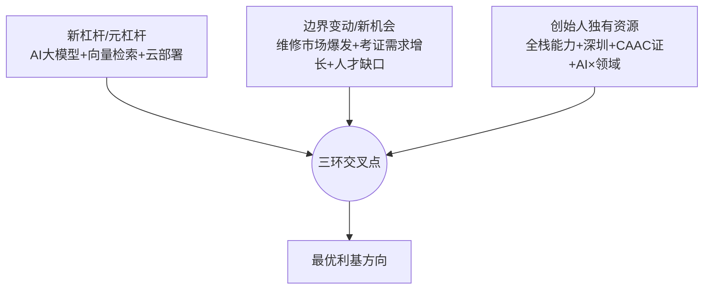

# DroneDoctor 利基定位报告

> **说明**：本报告按 OPC（一人公司）方法论第 02 阶段要求，使用「三环合一」框架和「六维机会评分」模型，为 DroneDoctor 项目确定最优利基方向。分析基于 01 资源盘点产出和市场调研数据。
>
> **核心框架**：三环合一 = 新杠杆/元杠杆 ⊕ 边界变动带来的新机会 ⊕ 创始人独有资源和优势。三环重叠的地方就是最优利基。
>
> **分析日期**：2025年5月30日

---

## 一、三环合一分析

### 环1：新杠杆/元杠杆

**定义**：新技术、新平台、新趋势带来的杠杆效应，能让你用更少资源撬动更大价值。

| 杠杆类型 | 具体表现 | 对 DroneDoctor 的意义 |
|---------|---------|-------------------|
| **AI 大语言模型** | Kimi API、百度文心一言等国产大模型成熟，API 调用成本可控 | 1. 实现智能故障诊断，用户输入现象 → AI 生成排查步骤 2. 语义检索知识库，比关键词搜索精准 10 倍 3. 自动生成维修教程、案例总结，降低内容生产成本 |
| **向量数据库** | pgvector 等开源向量数据库成熟，语义搜索门槛大幅降低 | 构建专业级知识库，实现"语义级"而非"关键词级"的知识检索 |
| **移动端 + 云端部署** | Vercel + Railway 等 Serverless 平台成熟，一个人也能运维高可用服务 | MVP 快速上线，迭代成本极低，验证期月成本可控在几百元 |
| **国内 AI 开放生态** | 百度千帆、Kimi 等提供丰富的 API 和文档，降低集成难度 | 创始人已有 AI 工程集成经验，能快速实现 AI 功能 |

**杠杆评估**：✅ **强杠杆**。AI 大模型是 DroneDoctor 的核心技术杠杆，能让一个人做出传统团队才能做的智能诊断产品。

---

### 环2：边界变动带来的新机会

**定义**：行业或市场正在发生的变化，创造了新的需求窗口。

| 边界变动 | 数据支撑 | 创造的机会 |
|---------|---------|----------|
| **无人机保有量爆发** | 全国 328.7 万台无人机，超 80% 过质保期 | 维修需求刚性增长，用户需要自助维修方案 |
| **维修市场快速增长** | 2025 年无人机维修市场预计 500 亿元，年复合增长率 >20% | 大市场中的细分机会，AI 诊断工具可切入 |
| **CAAC 考证需求激增** | 2024 年新增 5.29 万本有效执照，总有效执照 24.73 万本 | 考证人群持续增长，备考工具需求旺盛 |
| **维修人才缺口巨大** | 行业报告显示人才缺口达百万级别 | 维修培训、认证市场有长期需求 |
| **消费级无人机自修趋势** | DJI 等品牌维修成本高、周期长，用户倾向于先自行排查 | 轻量级诊断工具的市场需求 |
| **无人机维修专业化** | 行业报告指出维修服务正在标准化、专业化 | 专业工具和知识平台的价值凸显 |

**时机评估**：✅ **黄金窗口**。市场正处于快速增长期，但缺乏专业化的 AI 诊断工具，竞争格局尚未固化。

---

### 环3：创始人独有资源和优势

**定义**：创始人拥有的、难以被复制的资源和能力。

| 资源/优势 | 稀缺度 | 与利基方向的关联 |
|----------|--------|----------------|
| **全栈独立交付能力** | 高 | 能独立完成从产品设计、开发、部署到上线的全流程，极低开发成本 |
| **深圳 + 无人机产业核心地带** | 高 | DJI 总部、维修店、培训机构密集，便于获取内容、建立合作、线下推广 |
| **CAAC 机长证** | 高 | 行业权威性背书，内容可信度的锚点，"持证机长"身份是信任加速器 |
| **AI 工程化 × 领域知识** | 高 | 既懂大模型 API、向量检索，又懂无人机维修场景，这种交叉能力稀缺 |
| **1 年资金储备 + 全职投入** | 高 | 充足验证窗口，不需要急着变现，可以从容把产品和用户基础做扎实 |
| **MVP 已完成** | 中 | 已跨越最耗时的开发阶段，可快速进入测试和市场验证 |

**资源评估**：✅ **高度匹配**。创始人的资源组合（技术+行业+地理+时间）在无人机维修/考证这个细分赛道中形成了独特优势。

---

### 三环交叉分析

**交叉结论**：三个环在以下方向高度重叠：

1. **AI 维修诊断工具**（维修需求 × AI 杠杆 × 创始人技术+行业优势）
2. **CAAC 考证备考平台**（考证需求 × AI 杠杆 × 创始人 CAAC 证+技术优势）

这两个方向都处于三环交叉区域，但侧重点不同，需要进一步用六维评分筛选。

---

## 二、候选利基方向分析

### 方向 1：AI 维修诊断工具（面向无人机飞手/玩家）

**目标用户画像**：
- **人群**：DJI 消费级无人机用户、航拍爱好者、无人机玩家
- **年龄**：25-45 岁，男性为主
- **痛点**：无人机出现故障时，不知道问题在哪、如何排查、是否需要送修
- **行为特征**：习惯在微信群、论坛求助，愿意尝试自助维修
- **付费意愿**：中等（与送修成本相比，工具订阅费可接受）

**市场规模估算**：
- **潜在用户基数**：全国 328.7 万台无人机，假设 30% 的用户会遇到需要排查的故障 → ~100 万潜在用户
- **可触达市场**：DJI 消费级用户占主流，假设 50% 的故障用户会尝试 AI 工具 → ~50 万可触达用户
- **付费转化率**：参考同类工具类 SaaS，假设 5% 的可触达用户会付费 → ~2.5 万付费用户
- **年收入天花板**：2.5 万用户 × 299 元/年（年度会员） = **747.5 万元/年**

**竞争格局分析**：
| 竞争对手 | 定位 | 优势 | 劣势 |
|---------|------|------|------|
| **DroneFix（App）** | DJI 无人机维修知识库，¥12 一次性购买 | 1. 已上线 iOS，有实际产品 2. 离线可用，注重隐私 3. 价格便宜 | 1. 静态知识库，无 AI 诊断 2. 仅支持部分 DJI 机型 3. 无社群互动 |
| **DJI 官方支持** | 官方客服、维修指南 | 权威性高，官方资源 | 1. 响应慢，体验一般 2. 引导送修而非自助维修 3. 无 AI 智能诊断 |
| **微信群/论坛** | 用户互助，经验分享 | 社群活跃，信息及时 | 1. 信息碎片化，质量参差不齐 2. 无结构化知识库 3. 依赖高手在线 |
| **DroneDoctor（你）** | AI 智能诊断 + 知识库 | 1. AI 语义检索，精准匹配 2. 结构化故障排查流程 3. CAAC 机长证背书 | 1. 内容储备不足（仅 10 案例） 2. 无已运营渠道 3. 品牌认知度为零 |

**SWOT 分析**：
- **优势（S）**：AI 技术杠杆、CAAC 背书、深圳地理优势、MVP 已完成
- **劣势（W）**：内容储备不足、渠道从零、行业关系薄弱
- **机会（O）**：市场快速增长、竞品缺乏 AI 能力、用户自修趋势
- **威胁（T）**：DJI 可能推出官方 AI 工具、DroneFix 等竞品迭代、内容积累需要时间

**六维评分**（1-10 分，10 分最优）：

| 维度 | 评分 | 说明 |
|------|------|------|
| **杠杆/稀缺度** | **9** | AI 语义检索+智能诊断是核心差异化，竞品多为静态知识库 |
| **边界变动/时机** | **8** | 维修市场快速增长，用户自修需求旺盛，时机成熟 |
| **资源匹配度** | **9** | 全栈能力+AI 经验+CAAC 证+深圳，完美匹配 |
| **市场规模/天花板** | **7** | 消费级维修用户群体大，但付费意愿和客单价有限 |
| **竞争强度** | **7** | 有 DroneFix 等竞品，但缺乏 AI 能力，竞争不算激烈 |
| **可持续性/壁垒** | **6** | 内容积累和技术迭代可建立壁垒，但需持续投入 |
| **综合评分** | **7.7** | |

---

### 方向 2：CAAC 考证备考平台（面向考证人群）

**目标用户画像**：
- **人群**：计划考取 CAAC 无人机执照的学员、培训机构学员、转行从业者
- **年龄**：20-40 岁，男性为主，部分女性
- **痛点**：考试内容多、缺乏系统题库、不知道考试重点、模拟考试机会少
- **行为特征**：主动搜索考试信息，愿意为备考工具付费
- **付费意愿**：较高（考证是刚需，愿意为提高通过率付费）

**市场规模估算**：
- **潜在用户基数**：2024 年新增 5.29 万本有效执照，假设每年有 8-10 万人参加考试（含未通过者） → ~10 万/年
- **可触达市场**：假设 40% 的考生会使用在线备考工具 → ~4 万/年可触达用户
- **付费转化率**：参考考试类 SaaS，假设 15% 会付费 → ~6000 付费用户/年
- **年收入天花板**：6000 用户 × 299 元（年度会员） = **179.4 万元/年**

**竞争格局分析**：
| 竞争对手 | 定位 | 优势 | 劣势 |
|---------|------|------|------|
| **培训机构自建系统** | 各培训机构自有的题库和模拟考试 | 与培训绑定，用户信任度高 | 1. 封闭系统，非学员难获取 2. 质量参差不齐 3. 缺乏 AI 个性化 |
| **通用考试平台** | 粉笔、猿题库等（可能有无人机板块） | 品牌知名，技术成熟 | 1. 非专注无人机，内容深度不足 2. 缺乏行业专业性 |
| **DroneDoctor（你）** | AI 题库 + 模拟考试 + 考证指南 | 1. CAAC 机长证背书，"过来人"身份 2. AI 可生成题目、智能推荐 3. 专注无人机垂直领域 | 1. 题库内容需大量积累 2. 需要获取考试真题/大纲 3. 与培训机构可能形成竞争或合作 |

**SWOT 分析**：
- **优势（S）**：CAAC 机长证背书、AI 技术能力、垂直领域专注
- **劣势（W）**：题库内容空白、无培训机构合作关系、品牌认知度低
- **机会（O）**：考证人数持续增长、现有备考工具质量不高、AI 个性化学习趋势
- **威胁（T）**：培训机构自建系统、通用考试平台进入、政策变化

**六维评分**（1-10 分，10 分最优）：

| 维度 | 评分 | 说明 |
|------|------|------|
| **杠杆/稀缺度** | **7** | AI 可生成题目和个性化推荐，但技术门槛相对较低 |
| **边界变动/时机** | **7** | 考证人数增长，但增速不如维修市场 |
| **资源匹配度** | **8** | CAAC 机长证是核心优势，技术能力可支撑 |
| **市场规模/天花板** | **6** | 用户基数相对较小，客单价有限 |
| **竞争强度** | **6** | 竞争对手分散，但培训机构有先发优势 |
| **可持续性/壁垒** | **5** | 题库积累可建立壁垒，但容易被模仿 |
| **综合评分** | **6.5** | |

---

### 方向 3：无人机维修知识 SaaS（面向维修店/培训机构）

**目标用户画像**：
- **人群**：无人机维修店、培训机构、企业设备管理部门
- **决策者**：店主、培训讲师、设备管理员
- **痛点**：维修知识分散、新人培训成本高、缺乏标准化流程
- **行为特征**：对工具付费意愿高，但决策周期长
- **付费意愿**：高（B 端客单价可达数千元/年）

**市场规模估算**：
- **潜在客户数**：全国无人机维修店约数千家，培训机构约数百家 → ~5000-10000 家
- **可触达市场**：假设 20% 会使用专业 SaaS → ~1000-2000 家
- **付费转化率**：B 端 SaaS 假设 10% 会付费 → ~100-200 家
- **年收入天花板**：200 家 × 3000 元/年（企业版） = **60 万元/年**

**竞争格局分析**：
| 竞争对手 | 定位 | 优势 | 劣势 |
|---------|------|------|------|
| **行业报告/手册** | 纸质或 PDF 格式的维修手册 | 权威性高 | 1. 更新慢 2. 无交互性 3. 不便检索 |
| **通用知识管理工具** | Notion、飞书等通用工具 | 功能强大，用户习惯 | 1. 非专业，需自行搭建 2. 缺乏行业模板 |
| **DroneDoctor（你）** | AI 维修知识库 + 诊断工具 | 1. 专业垂直，开箱即用 2. AI 语义检索 3. 可定制化 | 1. B 端销售能力待建立 2. 需要更强的客户成功能力 3. 内容深度需大幅提升 |

**SWOT 分析**：
- **优势（S）**：技术能力、深圳地理优势、专业内容
- **劣势（W）**：无 B 端销售经验、无行业深度关系、内容储备不足
- **机会（O）**：维修行业数字化趋势、培训机构标准化需求
- **威胁（T）**：大厂进入、客户决策周期长、续费率挑战

**六维评分**（1-10 分，10 分最优）：

| 维度 | 评分 | 说明 |
|------|------|------|
| **杠杆/稀缺度** | **6** | AI 知识库有价值，但 B 端更看重内容深度和服务 |
| **边界变动/时机** | **5** | 行业数字化趋势存在，但不够强烈 |
| **资源匹配度** | **5** | 技术能力匹配，但 B 端销售和客户成功能力欠缺 |
| **市场规模/天花板** | **5** | 客户基数小，客单价有限 |
| **竞争强度** | **5** | 竞争对手分散，但客户获取成本高 |
| **可持续性/壁垒** | **6** | 内容积累和客户关系可建立壁垒 |
| **综合评分** | **5.3** | |

---

### 方向 4：无人机维修培训/认证（面向想学维修的人）

**目标用户画像**：
- **人群**：想学习无人机维修的爱好者、转行从业者、培训机构学员
- **年龄**：20-35 岁，男性为主
- **痛点**：缺乏系统学习路径、不知道如何入门、缺乏实践机会
- **行为特征**：愿意为系统学习付费，但需要看到明确价值
- **付费意愿**：中高（课程费用可达数千元）

**市场规模估算**：
- **潜在用户基数**：每年有数万人对无人机维修感兴趣，但实际学习者较少 → ~1-2 万/年
- **可触达市场**：假设 30% 会使用在线课程 → ~3000-6000/年
- **付费转化率**：课程类假设 8% 会付费 → ~240-480 付费用户/年
- **年收入天花板**：480 用户 × 1000 元（课程费用） = **48 万元/年**

**竞争格局分析**：
| 竞争对手 | 定位 | 优势 | 劣势 |
|---------|------|------|------|
| **线下培训机构** | 线下授课，实践操作 | 实操性强，有证书 | 1. 价格高 2. 地域限制 3. 时间不灵活 |
| **在线课程平台** | 腾讯课堂、网易云课堂等 | 流量大，品牌知名 | 1. 课程质量参差不齐 2. 缺乏垂直专业性 |
| **DroneDoctor（你）** | AI 辅助学习 + 知识库 | 1. CAAC 机长证背书 2. AI 个性化学习 3. 深圳地理优势可结合线下 | 1. 课程开发能力待建立 2. 需要更深度的行业关系 3. 品牌认知度低 |

**SWOT 分析**：
- **优势（S）**：CAAC 背书、深圳地理优势、技术能力
- **劣势（W）**：无课程开发经验、无行业深度关系、品牌认知度低
- **机会（O）**：维修人才缺口大、在线学习趋势、AI 个性化学习
- **威胁（T）**：线下培训机构、大平台课程、政策变化

**六维评分**（1-10 分，10 分最优）：

| 维度 | 评分 | 说明 |
|------|------|------|
| **杠杆/稀缺度** | **5** | AI 可辅助学习，但核心价值在于内容深度和行业资源 |
| **边界变动/时机** | **6** | 人才缺口大，但在线培训市场竞争激烈 |
| **资源匹配度** | **6** | CAAC 背书有价值，但课程开发和行业关系不足 |
| **市场规模/天花板** | **4** | 用户基数小，客单价有限 |
| **竞争强度** | **6** | 竞争对手多，但质量参差不齐 |
| **可持续性/壁垒** | **5** | 内容积累和行业口碑可建立壁垒 |
| **综合评分** | **5.3** | |

---

### 方向 5：综合无人机服务平台（维修+考证+培训）

**目标用户画像**：
- **人群**：所有无人机相关人群（飞手、维修人员、考证学员、培训学员）
- **痛点**：信息分散，需要一站式服务
- **付费意愿**：多样（从免费到高价课程）

**市场规模估算**：
- **潜在用户基数**：所有无人机相关人群 → ~100 万+
- **可触达市场**：假设 10% 会使用综合平台 → ~10 万
- **付费转化率**：假设 3% 会付费 → ~3000 付费用户
- **年收入天花板**：3000 用户 × 300 元/年 = **90 万元/年**

**竞争格局分析**：
| 竞争对手 | 定位 | 优势 | 劣势 |
|---------|------|------|------|
| **DJI 官方生态** | 官方社区、支持、维修 | 权威性高，用户基数大 | 1. 引导送修 2. 无 AI 诊断 3. 封闭生态 |
| **行业垂直社区** | 无人机世界、飞兽社区等 | 用户活跃，内容丰富 | 1. 信息碎片化 2. 缺乏 AI 能力 3. 商业化程度低 |
| **DroneDoctor（你）** | AI 综合服务平台 | 1. AI 技术杠杆 2. 一站式服务 3. CAAC 背书 | 1. 资源分散，难以聚焦 2. 每个板块都需要深度 3. 开发运营成本高 |

**SWOT 分析**：
- **优势（S）**：技术能力、CAAC 背书、深圳地理优势
- **劣势（W）**：资源分散、每个板块都需深度、开发运营成本高
- **机会（O）**：市场需要一站式服务、AI 技术可整合多个板块
- **威胁（T）**：DJI 官方生态、大平台进入、资源分散导致每个板块都不精

**六维评分**（1-10 分，10 分最优）：

| 维度 | 评分 | 说明 |
|------|------|------|
| **杠杆/稀缺度** | **6** | AI 可整合多个板块，但每个板块都需要深度 |
| **边界变动/时机** | **6** | 市场需要一站式服务，但执行难度大 |
| **资源匹配度** | **5** | 技术能力匹配，但资源分散，难以聚焦 |
| **市场规模/天花板** | **7** | 用户基数大，但付费转化率低 |
| **竞争强度** | **7** | 竞争对手多，但缺乏 AI 能力 |
| **可持续性/壁垒** | **5** | 一站式服务可建立壁垒，但执行难度大 |
| **综合评分** | **6.0** | |

---

## 三、推荐利基方向

### 主要推荐方向：AI 维修诊断工具

**推荐理由**：

1. **三环交叉度最高**：AI 杠杆 × 维修市场爆发 × 创始人资源完美匹配
2. **六维评分最高**：综合得分 7.7，在所有候选方向中排名第一
3. **差异化明显**：现有竞品多为静态知识库，AI 诊断是核心差异化
4. **资源匹配度高**：创始人的技术能力、CAAC 背书、深圳地理优势都能充分发挥
5. **时机成熟**：维修市场快速增长，用户自修需求旺盛，竞争格局尚未固化
6. **可扩展性强**：先做维修诊断，积累用户和内容后，可自然扩展到考证、培训等板块

**次级推荐方向：CAAC 考证备考平台**

**推荐理由**：

1. **CAAC 背书价值最大化**：创始人的 CAAC 机长证在这个方向价值最高
2. **用户付费意愿强**：考证是刚需，用户愿意为提高通过率付费
3. **可作为第二阶段扩展**：先做维修诊断，积累用户后扩展到考证板块
4. **六维评分中等**：综合得分 6.5，有潜力但不如维修诊断

**不推荐方向**：

1. **无人机维修知识 SaaS（B 端）**：资源匹配度低，B 端销售能力不足，市场天花板有限
2. **无人机维修培训/认证**：资源匹配度低，课程开发能力不足，市场天花板有限
3. **综合无人机服务平台**：资源分散，难以聚焦，执行难度大

---

## 四、利基定位陈述

**主定位**：
> DroneDoctor 为无人机飞手/玩家提供 AI 智能故障诊断与维修知识服务，通过自然语言交互实现"输入故障现象 → AI 生成排查步骤 → 结构化维修指南"的闭环，解决无人机故障时"不知道问题在哪、如何排查、是否需要送修"的核心痛点。

**副定位**（第二阶段扩展）：
> DroneDoctor 为 CAAC 无人机考证学员提供 AI 驱动的备考平台，通过智能题库、模拟考试、个性化推荐，解决"考试内容多、缺乏系统题库、不知道考试重点"的备考痛点。

**一句话定位**：
> **DroneDoctor 是无人机用户的 AI 维修助手，用 AI 让每个人都能像专业维修师一样诊断和解决无人机故障。**

---

## 五、下一步行动建议

### P0：立即行动（上线前）

1. **完善 MVP 测试**：修复 Bug，优化用户体验，尽快上线
2. **处理合规事项**：注册公司主体、域名、ICP 备案
3. **扩充内容储备**：目标将故障案例从 10 个扩充到 50 个，覆盖主流 DJI 机型
4. **建立种子用户群**：利用深圳地理优势，线下接触 3-5 家维修店，获取种子用户

### P1：上线后 1-3 个月

1. **验证产品-市场匹配**：观察用户留存、诊断准确率、付费转化率
2. **迭代 AI 能力**：优化 Prompt，提升诊断准确性，增加更多机型支持
3. **建立内容渠道**：在知乎、小红书、抖音输出无人机维修/考证内容，建立获客渠道
4. **拓展行业合作**：接触维修店、培训机构，探索合作可能性

### P2：上线后 3-6 个月

1. **扩展考证板块**：如果维修诊断验证成功，扩展 CAAC 考证备考功能
2. **优化商业模式**：根据用户反馈调整定价和分层策略
3. **建立行业口碑**：通过内容营销和用户口碑，建立品牌认知度
4. **探索 B 端机会**：如果 C 端验证成功，探索向维修店/培训机构提供 SaaS 服务

### P3：上线后 6-12 个月

1. **规模化增长**：通过付费获客、内容营销、行业合作扩大用户规模
2. **深化技术壁垒**：优化 AI 模型，增加图像诊断、故障预测等高级功能
3. **建立行业标准**：成为无人机维修诊断领域的事实标准
4. **探索新机会**：基于用户数据和行业洞察，探索新的增长机会

---

## 六、风险提示

1. **内容积累风险**：维修知识库需要大量高质量内容，初期可能不足
2. **AI 准确性风险**：AI 诊断可能出错，需要建立纠错和反馈机制
3. **竞争风险**：DJI 官方或 DroneFix 等竞品可能推出 AI 功能
4. **市场教育风险**：用户可能不习惯使用 AI 诊断，需要市场教育
5. **政策风险**：无人机政策变化可能影响市场需求

**应对策略**：
1. 优先积累高频故障案例，利用深圳地理优势获取真实案例
2. 建立"AI 诊断 + 人工复核"的双重保障机制
3. 持续迭代 AI 能力，保持技术领先
4. 通过内容营销和用户教育降低市场教育成本
5. 关注政策变化，及时调整产品方向

---

## 附录：六维评分汇总表

| 方向 | 杠杆/稀缺度 | 边界变动/时机 | 资源匹配度 | 市场规模/天花板 | 竞争强度 | 可持续性/壁垒 | 综合评分 |
|------|-------------|-------------|-----------|---------------|----------|--------------|----------|
| **AI 维修诊断工具** | 9 | 8 | 9 | 7 | 7 | 6 | **7.7** |
| CAAC 考证备考平台 | 7 | 7 | 8 | 6 | 6 | 5 | **6.5** |
| 综合无人机服务平台 | 6 | 6 | 5 | 7 | 7 | 5 | **6.0** |
| 无人机维修知识 SaaS | 6 | 5 | 5 | 5 | 5 | 6 | **5.3** |
| 无人机维修培训/认证 | 5 | 6 | 6 | 4 | 6 | 5 | **5.3** |

---

## 七、核心结论

1. **最优利基是 AI 维修诊断工具**：三环交叉度最高，六维评分最高，差异化明显，资源匹配度高
2. **CAAC 考证是第二阶段扩展方向**：CAAC 背书价值大，用户付费意愿强，可作为自然扩展
3. **创始人资源组合形成独特护城河**：全栈能力+CAAC证+AI×领域+深圳地理，这个组合在细分赛道中稀缺
4. **时机窗口正在打开**：维修市场爆发、考证需求增长、竞品缺乏 AI 能力，现在进入时机正好
5. **建议聚焦单点突破**：先做 AI 维修诊断工具，验证成功后再扩展到考证、培训等板块

---

> **报告说明**：本报告基于现有信息和市场调研进行合理推断，市场数据来自公开报告，竞争分析基于产品调研。实际执行中需根据市场反馈和用户数据持续调整定位策略。
